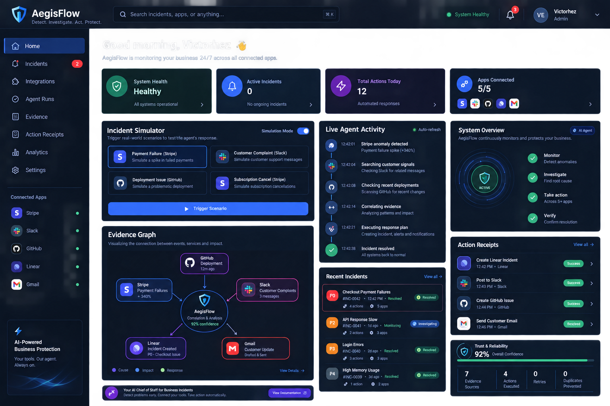

# AegisFlow

AegisFlow is an autonomous incident-response agent for teams that run on Stripe, Slack, GitHub, Linear, and Gmail. It connects the dots between disconnected business signals and produces an evidence-backed workflow before acting.



## How it works

When something breaks — a payment spike, a noisy deployment, or a batch of cancel signals — the evidence is usually scattered across tools. AegisFlow replaces the manual hop-around with a single workflow:

**Detect → collect evidence → correlate → decide → act → verify.**

## Integrations

| Tool     | What it's used for                                    |
|----------|-------------------------------------------------------|
| Stripe   | Payment anomalies and revenue impact                  |
| Slack    | Customer/team signals and response coordination       |
| GitHub   | Deployment history and engineering investigations      |
| Linear   | Incident creation, tracking, and coordination         |
| Gmail    | Customer communication prep and outbound updates      |

## Design priorities

- Evidence ledger captured before any consequential action
- Confidence-scored decisions with safety policy boundaries
- Idempotency keys on every provider action
- Retry envelopes for transient integration failures
- Timestamped receipts for each orchestration step
- Deterministic evaluation suite covering happy and failure paths

## What's in the repo

- Landing + auth pages
- Workspace dashboard (overview, integrations, agent runs, evidence, receipts, reliability, settings)
- Incident simulator and live evidence graph
- Integration configuration surface (server-side credential tests; secrets never touch localStorage)
- Reliability evaluation harness with 7 scenarios
- Safety policy and approval boundaries

## Getting started

```bash
npm install
npm run dev
```

Open http://localhost:3000.

To verify a production build and the evaluation suite:

```bash
npm run build
npm run evaluate
```

## Environment variables

Copy `.env.example` to `.env.local` and fill in the keys you want to use. Never commit real credentials or tokens.

- `STRIPE_SECRET_KEY` — payment anomaly lookups
- `SLACK_BOT_TOKEN` — read customer/team signals, post alerts
- `GITHUB_TOKEN` — deployments and investigation issues
- `LINEAR_API_KEY` — incident creation and state updates
- `GMAIL_CLIENT_ID` / `GMAIL_CLIENT_SECRET` — customer communication (OAuth)
- `NEXT_PUBLIC_APP_URL` — e.g. `http://localhost:3000`

## Deploying to Vercel

1. Push the repo to GitHub.
2. Import the project into Vercel.
3. Add the environment variables above in Project Settings → Environment Variables.
4. Deploy. `vercel.json` is set up for the default Next.js build pipeline.

## API routes

- `POST /api/orchestrate` — run an incident workflow
- `GET /api/incidents` — incident list and severity/status counts
- `GET /api/evidence` — evidence ledger with confidence tiers
- `GET /api/agent-runs` — full orchestration run history
- `GET /api/receipts` — action receipts with idempotency keys and status
- `GET /api/workspace` — workspace, integrations, system health summary
- `GET /api/integrations` — integration list + last sync state
- `POST /api/integrations/test` — server-side credential liveness test
- `GET /api/evaluate` — reliability evaluation scenarios
- `GET /api/health` — health check

## Integrations in this build

The orchestrator runs against a deterministic scenario engine so the end-to-end flow is reproducible. The Integrations page provides the real configuration surface for each provider; actually executing against Stripe/Slack/GitHub/Linear/Gmail requires valid API credentials or an OAuth flow.

## Demo video

```
YOUTUBE_DEMO_URL=[https://youtu.be/yuFKup-IA4o?si=26rIB3cdDRXTLGMu](https://youtu.be/yuFKup-IA4o?si=26rIB3cdDRXTLGMu)
```

## Repo safety

Don't commit `.env`, `.env.local`, OAuth secrets, API keys, customer data, or production tokens.
